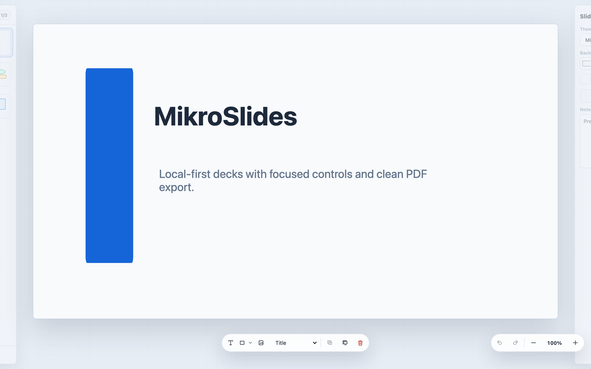

:::tip[Use MikroSlides Online]
Open [slides.mikrosuite.com](https://slides.mikrosuite.com) to use MikroSlides directly for free. It runs over HTTPS, needs no account, and keeps decks in browser storage for that site unless you export them.
:::

MikroSlides is a minimalist, local-first presentation app for browser-based decks. It runs in the browser, stores decks locally for the current site, and includes the everyday tools needed to create, edit, present, import, and export slide decks.

Decks live in browser IndexedDB by default. MikroSlides does not require an account, application server, or hosted file manager. You can move decks between browsers, machines, or deployments by exporting deck files.

## What's Included

- **Local deck library**: decks are saved in your browser for the current browser profile and origin.
- **Slide editor**: create slides with text, shapes, images, speaker notes, aspect ratios, themes, and fonts.
- **Slide rail**: add, reorder, duplicate, copy, paste, delete, and skip slides.
- **Object editing**: select, move, resize, align, layer, duplicate, copy, paste, and delete objects.
- **File flows**: import Markdown deck sources and MikroSlides files; export JSON, portable `.mikroslides`, PDF, and PNG.
- **Presentation mode**: present from the browser with keyboard navigation and skipped-slide handling.
- **Layouts and templates**: use built-in layouts and save local templates.

## How It Works

The app shell is static HTML, CSS, and JavaScript. When you deploy MikroSlides to a static host, the app loads from that host, and deck content stays in browser storage unless you choose an import, export, backup, or print action.

## Who It Is For

MikroSlides is useful for project updates, talks, lightweight reports, workshops, and decks that should remain portable as files.

It is not a real-time collaboration tool, cloud sync service, or full design suite. Presentation editing is intentionally focused so the app stays understandable, portable, and easy to host.

## Get Started

To run your own copy, download the static release archive:

```bash
curl -sSL -o mikroslides.zip https://releases.mikrosuite.com/mikroslides_latest.zip
unzip mikroslides.zip -d mikroslides
```

See [Installation](../getting-started/installation) for the local serving walkthrough.
